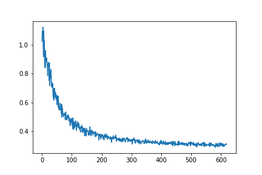

# Face Recognition Task
In this dataset we have ~150 faces which we are tasked with labelling appropriately. We are given a 128 dimensional vector which represent the facial image. We do not attempt to recreate these vectors.

Note that if you wish to run the models, I moved all the images into the `data` subdirectory. 
.
├── FaceNet.ipynb
├── README.md
├── Tensorboard_vis.ipynb
├── data
│   ├── Abdullah_Gul
│   │   ├── Abdullah_Gul_0001.npy
...

## Tensorboard Visualisation
The jupyter notebook contains the visualisation instructions of these embeddings. We sample 10 images from 10 classes and visualise these on tensorboard. However, there are no noteable clusters that emerge.

## Class Imbalance
There is a large class imbalance in the dataset. The most popular face (George Bush) having 500 images while the lowest category having 10. In order to balance the training set we sample 50 images from each class (after splitting into train-test set). This would mean some of the lowest classes would have repeated examples, while the larger classes will only select a subset of images. This is shown in code segment below.
```
for i,l in enumerate(u_train_labels):
    idx = np.random.choice(np.where(train_labels==l)[0], n_repeat)
    train_embeds2[i*n_repeat:(i+1)*n_repeat,:] = train_embeds[idx]
    train_labels2[i*n_repeat:(i+1)*n_repeat] = train_labels[idx]
```

## Keras Model
We create the following model which takes in the 128 dimensional vector and outputs a probability of belonging to a class:
```
model = Sequential()
model.add(Dense(units=10, activation='relu', input_dim=train_embeds.shape[1]))
model.add(Dense(units=10, activation='relu'))
model.add(Dense(units=len(u_train_labels), activation='softmax'))

model.compile(loss='sparse_categorical_crossentropy', optimizer='adam', metrics=["accuracy"])
model.summary()
```
During training we reduced the learning rate when the _validation loss_ achieved plateau. This was done by further splitting the training set into a 5% validation set and using keras `callbacks` function.

We were able to achieve an accuracy of 6% on the test set (which is better than a random estimate 1/158).

## Attempted FaceNet
This section was simply an attempt as I could not get FaceNet working on a meaningful way. As the embeddings were precomputed, I attempted to create a new 15 dimensional embedding by having two layers:
```
with tf.name_scope('mlp'):
    h1 = tf.layers.dense(inputs=xs, units=15, activation=tf.nn.relu,
                         name='h1')
    out = tf.layers.dense(h1, units=15, name='out')

# convert to unit length
len_out = tf.sqrt(tf.reduce_sum(tf.square(out), axis=-1, keepdims=True))
out = out / len_out
```
The layer was subsequentially normalised to have unit length.

This is perhaps not how I would approach the problem, if time wasn't a constraint. I would be running a Deep Network to find the 128 dimensional embeddings in the first place.

What's unique to FaceNet is the loss function. It takes a batch of exemplar images (named anchors), and takes images of the same class that are far in the embedding space (called positives), and images that of a different class and are close in embedding space (called negatives). It then uses the following (triplet) loss function:
```
with tf.name_scope('triplet_loss'):
    pos_dist = tf.reduce_sum(tf.square(out_a - out_p), axis=-1)
    neg_dist = tf.reduce_sum(tf.square(out_a - out_n), axis=-1)
    basic_loss = pos_dist - neg_dist + alpha
    loss = tf.reduce_mean(tf.nn.relu(basic_loss))
```
The aim of which is to reduce the distance between anchors and positives while maximising distance between anchors and negatives. `alpha` is a small positive constant, in this case 0.3.

However, as seen below, the loss converges to `alpha`. 

This is due to the fact that the new embedding vectors all converge to a singular vector such that `out_a ~ out_p ~ out_n`.

Initially I took for each anchor, the worst positive example, and worst negative example (in that its too close to anchor). In this case `neg_dist ~ 0`, and did not contribute much to the final loss. Therefore, I changed the negative example to be randomly chosen. Unfortunately this didnt help much either, with the loss still converging to `alpha`. Selecting the right positive and negative examples seem to be key to getting FaceNet working.

Had this worked it would have been the most robust to new faces entering the system since there is a distance metric.

## KNN
This simple algorithm achieved the highest accuracy. Using 5 neighbours on **the original embeddings** the algorithm was able to achieve 7% accuracy.